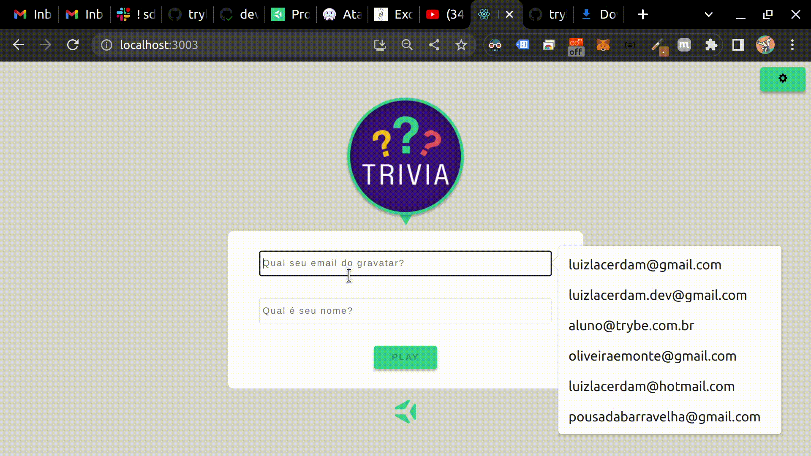

# Boas vindas ao projeto Trivia Game!
  Projeto em grupo durante o curso de desenvolvimento web na trybe.

  O objetivo é colocar em prática tudo o que aprendi sobre React e Redux ⚛️ até aqui, enquanto pratico a organização de um projeto em equipe com a metodologia agile Kanban..

## Habilidades
- Criar um store Redux em aplicações React

- Criar reducers no Redux em aplicações React

- Criar actions no Redux em aplicações React

- Criar dispatchers no Redux em aplicações React

- Conectar Redux aos componentes React

- Criar actions assíncronas na sua aplicação React que faz uso de Redux.

- Escrever testes para garantir que sua aplicação possua uma boa cobertura de testes.

## Veja o resultado a seguir do projeto pronto:
  

## Requisitos Obrigatorios:

    ✅ 1.Crie a tela de login, onde a pessoa que joga deve preencher as informações para iniciar um jogo.

    ✅ 2. Crie o botão de iniciar o jogo.

    ✅ 3. Crie um botão que leva a pessoa para tela de configuração.
    
    ✅ 4. Desenvolva testes para atingir 90% de cobertura da tela de Login.
---
### Tela de jogo
###
    ✅ 5. Crie um header que deve conter as informações da pessoa jogadora.

    ✅ 6. Crie a página de jogo que deve conter as informações relacionadas à pergunta.

    ✅ 7. Desenvolva o estilo que, ao clicar em uma resposta, a correta deve ficar verde e as incorretas, vermelhas.

    ✅ 8. Desenvolva um timer onde a pessoa que joga tem 30 segundos para responder.
    
    ✅ 9. Crie o placar com as seguintes características:
    - Será validado se os pontos são somados ao acertar uma questão
    - Será validado se os pontos não são somados ao errar uma questão

    ✅ 10. Crie um botão de Next que apareça após a resposta ser dada.
    
    ✅ 11. Desenvolva o jogo de forma que a pessoa jogadora deve responder 5 perguntas no total.
    
---
### Tela de feedback
###
    ✅ 12. Desenvolva o header de feedback que deve conter as informações da pessoa jogadora.
    
    ✅ 13. Crie a mensagem de feedback para ser exibida a pessoa usuária.
    
    ✅ 14. Exiba as informações relacionadas aos resultados obtidos para a pessoa usuária.
    
    ✅ 15. Crie a opção para a pessoa jogadora poder jogar novamente.
    
    ✅ 16. Crie a opção para a pessoa jogadora poder visualizar a tela de ranking.
    
    ✅ 17. Desenvolva testes para atingir 90% de cobertura da tela de Feedbacks.
    
---
### Tela de ranking
###
    
    ✅ 18. Crie um botão para ir ao início.
    
    ✅ 19. Crie o conteúdo da tela de ranking.
    
    ✅ 20. Desenvolva testes para atingir 90% de cobertura da tela de Ranking.
    
---
### Testes da tela de jogo
###
    
    ✅ 21. Desenvolva testes para atingir 90% de cobertura da tela de Jogo.  
    
---
### Testes da aplicação
###
    
    ✅ 22. Desenvolva testes para atingir 95% de cobertura total.
    

